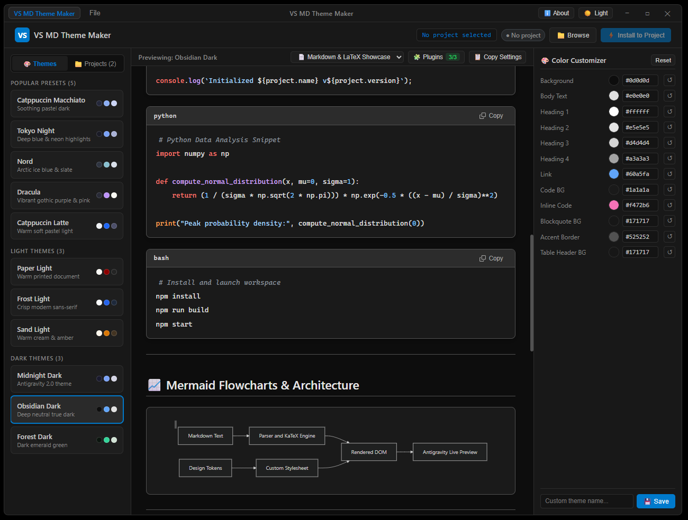
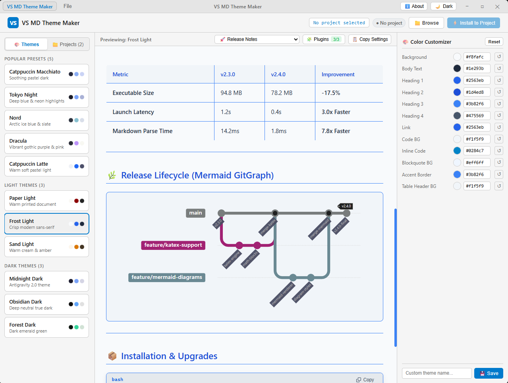

# VS Markdown Theme Maker 🎨

An open-source Electron desktop app and theme customizer for VS Code & Antigravity IDE Markdown previews.

> 💡 **Inspiration & Story**: This is a **vibecoded** app built using **Antigravity IDE** and **Antigravity 2.0**, powered by **Claude** for strong technical implementation planning while **Antigravity** executed the end-to-end task. The inspiration behind this project comes from daily use of Antigravity IDE—where default Markdown preview themes often felt generic and hard to read. This tool makes creating, customizing, and applying vibrant, readable Markdown preview themes effortless.




---

## ✨ Features

- **Built-in Theme Gallery**: Preview and apply curated dark and light themes (Midnight Dark, Cyberpunk Neon, Solarized Light, GitHub Light, Nord, Dracula, and more).
- **Interactive Theme Customizer**: Real-time token editor for 12 color variables (backgrounds, text, headings, links, code blocks, borders, blockquotes, etc.).
- **Live Markdown Preview**: Instant preview render using sample Markdown content.
- **Custom Theme Management**: Save custom theme presets locally, switch between them, or delete them.
- **One-Click Installation**: Install themes directly into any target VS Code / Antigravity project (`.vscode/settings.json` and custom CSS output).
- **Workspace Project Registry**: Tracks installed projects and active themes.

---

## 🔌 Required IDE Plugins & Extensions

To get the complete rich Markdown experience (diagrams, math rendering, task lists, code block headers) inside **VS Code**, **Antigravity IDE**, or **Cursor**, make sure the following extensions are installed in your editor:

| Extension | Extension ID | Purpose |
| :--- | :--- | :--- |
| **Mermaid Diagram Engine** | `bierner.markdown-mermaid` | Renders flowcharts, sequence diagrams, git graphs, and architecture diagrams in native Markdown previews. |
| **KaTeX Math Engine** | `goessner.mdmath` | Fast, high-quality LaTeX math formula rendering for inline (`$...$`) and block (`$$...$$`) equations. |
| **Markdown All in One** | `yzhang.markdown-all-in-one` | Enables GFM task list checkboxes (`- [x]`), table auto-formatting, and editor shortcuts. |

> 💡 **Automatic Recommendation**: When you install a theme into a workspace via VS Markdown Theme Maker, these extensions are automatically added to your project's `.vscode/extensions.json` recommendation list so your IDE prompts you to install them.


### Prerequisites
- [Node.js](https://nodejs.org/) (v16+ recommended)
- [npm](https://www.npmjs.com/)

### Installation

1. **Clone the repository**:
   ```bash
   git clone https://github.com/Mightyiest/VS-Markdown-Theme-Maker.git
   cd VS-Markdown-Theme-Maker
   ```

2. **Install dependencies**:
   ```bash
   npm install
   ```

3. **Run the application**:
   ```bash
   npm start
   ```

---

## 📖 How to Use

1. **Browse Your Project**: Select your target VS Code / Antigravity project workspace folder.
2. **Apply or Create Theme**:
   - Choose a built-in theme from the gallery to apply directly.
   - Or customize color tokens using the editor and click **Save As New** to create a custom theme.
3. **Manage Installed Projects & Themes**:
   - Access saved projects anytime from the left sidebar menu.
   - Easily **Reinstall**, **Uninstall**, or switch themes for any saved project workspace.

---

## 📦 Building Executables (Portable & Installer)

To generate standalone Windows executables (saved locally in `dist/` and excluded from git):

- **Build Both (Portable & Installer)**:
  ```bash
  npm run build
  ```
- **Build Portable App Only**:
  ```bash
  npm run build:portable
  ```
- **Build Setup Installer Only**:
  ```bash
  npm run build:installer
  ```

---

## 🧪 Testing

Run unit test suite:
```bash
npm test
```

---

## 📂 Project Structure

```
VS-Markdown-Theme-Maker/
├── src/
│   ├── main.js                  # Main process & IPC handlers
│   ├── preload.js               # Context bridge API
│   ├── lib/                     # Core business logic & theme utilities
│   │   ├── theme-tokens.js      # Token extractor & CSS generator
│   │   ├── theme-registry.js    # Built-in theme definitions
│   │   ├── theme-installer.js   # VS Code project settings installer
│   │   ├── custom-themes.js     # User theme persistence storage
│   │   └── project-registry.js  # Installation tracker
│   └── renderer/                # UI Renderer process
│       ├── index.html           # Desktop interface layout
│       └── themes/              # Built-in CSS theme files
├── test/                        # Unit test suite
├── .gitignore                   # Git ignore settings
├── package.json                 # Project dependencies & scripts
└── LICENSE                      # MIT Open Source License
```

---

## 🤝 Contributing

Contributions, feature suggestions, and pull requests are welcome!

1. Fork the Project
2. Create your Feature Branch (`git checkout -b feature/AmazingFeature`)
3. Commit your Changes (`git commit -m 'Add some AmazingFeature'`)
4. Push to the Branch (`git push origin feature/AmazingFeature`)
5. Open a Pull Request

---

## 📄 License

Distributed under the **MIT License**. See [`LICENSE`](./LICENSE) for details.
