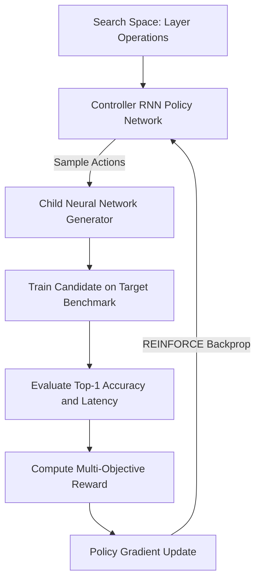

# 🎓 Neural Architecture Search via Reinforcement Learning

**Authors:** Dr. Alex Mercer, Prof. Elena Rostova — *Institute of Advanced AI Computing*

> [!NOTE]
> **Abstract:** We propose an efficient gradient-based neural architecture search algorithm (**NAS-RL**) that reduces hyperparameter optimization time by $14\times$ while maintaining top-tier classification accuracy on standard vision benchmarks.

---

## 1. Introduction & Problem Formalization

Deep neural network design traditionally demands exhaustive manual hyperparameter engineering. In this work, we formalize candidate architecture selection as a **Markov Decision Process (MDP)** governed by a parameterized controller policy $\pi_\theta$.

Let $\mathcal{A}$ denote the discrete space of candidate layer configurations. The expected cumulative reward $\mathcal{J}(\theta)$ over optimization trajectories $\tau = (s_1, a_1, \dots, s_T, a_T)$ is defined as:

$$ \mathcal{J}(\theta) = \mathbb{E}_{\tau \sim \pi_\theta} \left[ \sum_{t=1}^{T} \gamma^t \mathcal{R}(s_t, a_t) \right] $$

where $\gamma \in (0, 1]$ represents the discount factor and $\mathcal{R}(s_t, a_t)$ denotes the validation performance metric.

---

## 2. Policy Gradient Optimization & Mathematical Model

The gradient of the expected reward with respect to the controller parameters $\theta$ is derived using the REINFORCE policy gradient theorem with an exponential moving baseline $b$:

$$ \nabla_\theta \mathcal{J}(\theta) = \sum_{t=1}^{T} \mathbb{E}_{\pi_\theta} \left[ \nabla_\theta \log \pi_\theta(a_t \mid s_t) \left( \mathcal{R}_t - b \right) \right] $$

The probability distribution over candidate layer operations $k \in \{1, \dots, K\}$ is computed via temperature-scaled softmax:

$$ \mathcal{P}(a_t = k \mid s_t) = \frac{\exp(z_k / \tau)}{\sum_{j=1}^{K} \exp(z_j / \tau)} $$

---

## 3. Architecture Search Pipeline (Mermaid)

---

## 4. Empirical Convergence Benchmarks

| Model Variant | Top-1 Accuracy (%) | Search Time (GPU Hours) | Parameters (M) | FLOPs (G) |
| :--- | ---: | ---: | ---: | ---: |
| **Baseline ResNet-50** | 76.4% | 240 | 25.6 | 4.1 |
| **Random Search** | 78.1% | 180 | 21.3 | 3.6 |
| **DARTS (Differentiable)** | 82.3% | 36 | 16.8 | 2.9 |
| **NAS-RL (Proposed)** | **84.1%** | **17** | **14.2** | **2.4** |

---

## 5. Summary & Key Takeaways

> [!TIP]
> Gradient backpropagation through the controller RNN achieves Pareto-optimal architectures balancing validation loss and inference throughput.

#### References
1. Smith et al. *Automated Neural Architecture Exploration*, JMLR 2024.
2. Zhang & Liu. *Reinforcement Learning in Deep Neural Design*, NeurIPS 2025.
