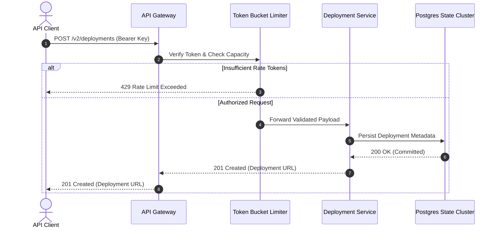

# Cloud Engine REST API Reference ⚡

Comprehensive API specification and schema documentation for distributed deployments.

> [!NOTE]
> All API endpoints require Bearer Token authorization header: `Authorization: Bearer <API_KEY>`.

---

## 1. `POST /v2/deployments`

Deploy a new application revision to cloud cluster infrastructure.

### Request Headers
| Header | Type | Required | Description |
| :--- | :--- | :--- | :--- |
| `Content-Type` | `string` | **Yes** | Must be `application/json` |
| `Authorization` | `string` | **Yes** | Bearer authentication token |
| `X-Workspace-ID` | `string` | Optional | Target workspace tenant UUID |

### Request Payload (`JSON`)

```json
{
  "project_name": "aurora-dashboard",
  "environment": "production",
  "replica_count": 4,
  "auto_scale": {
    "min": 2,
    "max": 8,
    "cpu_threshold_percent": 75
  },
  "environment_variables": {
    "NODE_ENV": "production",
    "PORT": 8080
  }
}
```

### Example Request (`cURL`)

```bash
curl -X POST https://api.antigravity.io/v2/deployments \
  -H "Authorization: Bearer sec_tok_8492048" \
  -H "Content-Type: application/json" \
  -d '{
    "project_name": "aurora-dashboard",
    "environment": "production",
    "replica_count": 4
  }'
```

---

## 2. Rate Limiting Model & Math Formula

API rate limits follow the **Token Bucket Algorithm**. The instantaneous token capacity $\mathcal{T}(t)$ at time $t$ given previous timestamp $t_0$ is governed by:

$$ \mathcal{T}(t) = \min\left( \mathcal{C}, \; \mathcal{T}(t_0) + \rho \cdot (t - t_0) \right) $$

where $\mathcal{C}$ denotes maximum burst capacity and $\rho$ represents the continuous token replenishment rate (tokens/second).

---

## 3. Request Lifecycle (Mermaid Sequence)



---

## 4. Response Status Codes

> [!TIP]
> Successful deployments return `201 Created` with the provisioned URL.

> [!WARNING]
> Exceeding your cluster allocation limits returns `429 Too Many Requests`.

| Status Code | Reason | Description |
| :--- | :--- | :--- |
| `201 Created` | Deployment Succeeded | Revision is live and routing traffic |
| `400 Bad Request` | Validation Error | Malformed JSON payload schema |
| `401 Unauthorized` | Invalid Token | Missing or expired Bearer token |
| `429 Rate Limited` | Limit Exceeded | Token bucket depleted; backoff required |
