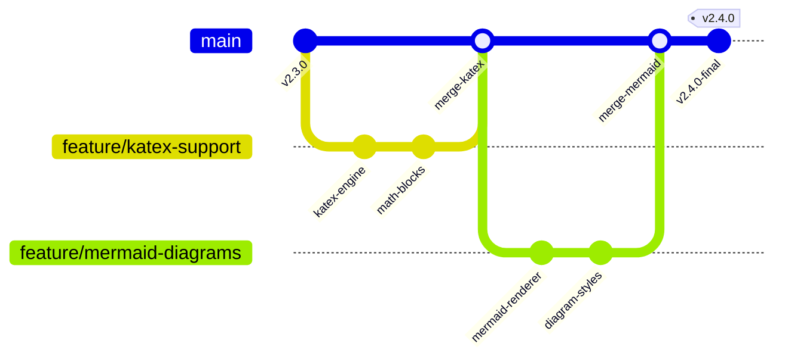

# 🚀 Release Notes — v2.4.0 (2026-08-11)

Major release featuring popular developer theme presets, LaTeX math rendering with KaTeX, interactive sample document switchers, Mermaid diagram support, and binary bundle size optimizations.

> [!WARNING]
> **Breaking Changes:** Theme configuration syntax in `.vscode/settings.json` now automatically normalizes custom theme identifiers.

---

## ✨ New Features & Capabilities

- 🔬 **LaTeX Math Formulas:** Synchronous math rendering for inline expressions and multiline display equations via KaTeX.
- 📈 **Mermaid Diagram Engine:** Native flowchart, sequence diagram, and git graph rendering directly in Markdown previews.
- 🎨 **Popular Developer Presets Pack:** Added Catppuccin, Tokyo Night, Nord, and Dracula community themes.
- 📄 **Sample Document Switcher:** Easily test themes against API specs, LaTeX physics notes, academic research papers, and READMEs.
- 🔒 **Single-Instance Lock:** Prevent duplicate background processes when launching from IDE terminals.

---

## ⚡ Performance Enhancements & Metrics

The speedup factor and bundle reduction percentage are derived mathematically:

$$ \text{Speedup} = \frac{T_{\text{baseline}}}{T_{\text{optimized}}} = \frac{1.2\,\text{s}}{0.4\,\text{s}} = 3.0\times \qquad \Delta_{\text{Bundle}} = \frac{94.8 - 78.2}{94.8} \times 100\% = 17.5\% $$

| Metric | v2.3.0 | v2.4.0 | Improvement |
| :--- | :--- | :--- | :--- |
| **Executable Size** | 94.8 MB | 78.2 MB | **-17.5%** |
| **Launch Latency** | 1.2s | 0.4s | **3.0x Faster** |
| **Markdown Parse Time** | 14.2ms | 1.8ms | **7.8x Faster** |

---

## 🌿 Release Lifecycle (Mermaid GitGraph)



---

## 📦 Installation & Upgrades

```bash
# Upgrade to latest release
npm install -g vs-md-theme-maker@latest

# Verify version
vs-md-theme-maker --version
```
