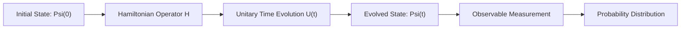
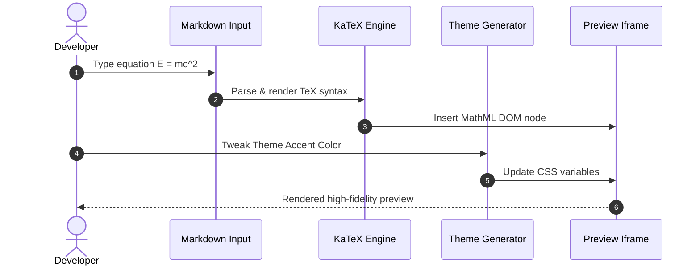

# Mathematical Physics & LaTeX Showcase 🔬

This document highlights advanced mathematical expressions rendered via **KaTeX** and structural workflows visualized with **Mermaid**.

> [!TIP]
> KaTeX renders TeX math formulas synchronously with sub-millisecond performance, crisp typography, and full MathML accessibility.

---

## 1. Maxwell's Equations in Differential Form

Gauss's Law for Electricity:
$$ \nabla \cdot \mathbf{E} = \frac{\rho}{\varepsilon_0} $$

Gauss's Law for Magnetism:
$$ \nabla \cdot \mathbf{B} = 0 $$

Faraday's Law of Induction:
$$ \nabla \times \mathbf{E} = -\frac{\partial \mathbf{B}}{\partial t} $$

Ampère's Circuital Law (with Maxwell's Addition):
$$ \nabla \times \mathbf{B} = \mu_0 \left( \mathbf{J} + \varepsilon_0 \frac{\partial \mathbf{E}}{\partial t} \right) $$

---

## 2. Quantum Mechanics & Wave Equations

Time-Dependent Schrödinger Equation:
$$ i\hbar \frac{\partial}{\partial t} \Psi(\mathbf{r}, t) = \left[ -\frac{\hbar^2}{2m} \nabla^2 + V(\mathbf{r}, t) \right] \Psi(\mathbf{r}, t) $$

Heisenberg Uncertainty Principle:
$$ \sigma_x \sigma_p \ge \frac{\hbar}{2} $$

---

## 3. Linear Algebra & Matrices

Rotation Matrix in $\mathbb{R}^3$ around the z-axis:
$$
R_z(\theta) = \begin{pmatrix}
\cos\theta & -\sin\theta & 0 \\
\sin\theta & \cos\theta & 0 \\
0 & 0 & 1
\end{pmatrix}
$$

Characteristic Polynomial and Eigenvalue Decomposition:
$$ \det(A - \lambda I) = 0 \qquad A \mathbf{v}_i = \lambda_i \mathbf{v}_i $$

---

## 4. Probability & Statistics

Multivariate Gaussian Normal Distribution:
$$ f(\mathbf{x} \mid \boldsymbol{\mu}, \boldsymbol{\Sigma}) = \frac{1}{\sqrt{(2\pi)^k |\boldsymbol{\Sigma}|}} \exp\left( -\frac{1}{2} (\mathbf{x} - \boldsymbol{\mu})^\top \boldsymbol{\Sigma}^{-1} (\mathbf{x} - \boldsymbol{\mu}) \right) $$

---

## 5. Calculus & Infinite Series

Taylor Series Expansion about $x = a$:
$$ f(x) = \sum_{n=0}^{\infty} \frac{f^{(n)}(a)}{n!} (x - a)^n $$

Fourier Transform and Inverse Fourier Transform Pair:
$$ \hat{f}(\xi) = \int_{-\infty}^{\infty} f(x) e^{-2\pi i x \xi} \, dx \qquad f(x) = \int_{-\infty}^{\infty} \hat{f}(\xi) e^{2\pi i x \xi} \, d\xi $$

---

## 6. Quantum Evolution Flowchart

---

## 7. Math & Preview Rendering Sequence

