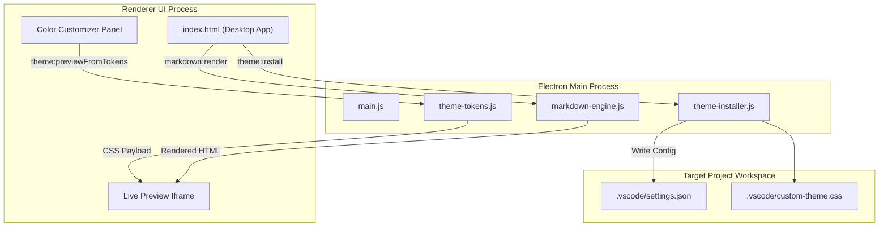

# 📦 VS MD Theme Maker

Customize, preview, and instantly install custom Markdown themes for VS Code and Antigravity IDE.

> [!NOTE]
> **Seamless Workspace Integration:** Instantly applies customized color tokens to your project's `.vscode/settings.json` with zero reload required.

---

## ✨ Key Features

- 🎨 **Theme Catalog:** Built-in Light, Dark, and Popular Developer Presets (Catppuccin, Tokyo Night, Nord, Dracula).
- 🎛️ **Live Color Customizer:** Per-token color pickers with instant preview iframe rendering.
- 📐 **LaTeX & KaTeX Support:** High-performance mathematical typesetting for academic and scientific documentation.
- 📊 **Mermaid Diagram Support:** Native rendering for flowcharts, sequence diagrams, and architecture graphs.
- 📁 **Project Registry:** Multi-project theme tracking and quick project selection.
- 🌙 **Light / Dark Mode App UI:** Built-in title bar theme toggle matching your system preferences.

---

## 🚀 Quickstart Guide

Follow these 3 simple steps to theme your workspace:

```bash
# 1. Clone repository
git clone https://github.com/example/vs-md-theme-maker.git

# 2. Install dependencies
npm install

# 3. Launch application
npm start
```

---

## 🏛️ Application Architecture (Mermaid)



---

## 🎨 Theme Specifications

| Token Name | Target Markdown Element | Default Value |
| :--- | :--- | :--- |
| `bgBody` | Page background | `#1a1a2e` |
| `textH1` | Heading 1 (H1) text | `#e2e2f0` |
| `textLink` | Hyperlink anchor text | `#7aa2f7` |
| `bgCode` | Code block background | `#252542` |
| `borderAccent` | Table and blockquote borders | `#4a4a70` |

---

## 📄 License & Contribution

Licensed under the MIT License. Contributions are welcome! Read our [Contributing Guidelines](#).
