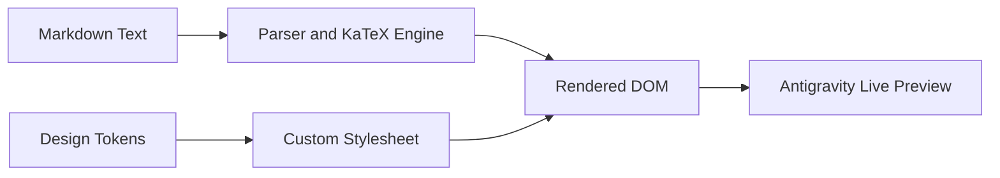

# Antigravity 2.0 — Markdown, LaTeX & Mermaid Showcase 🎨

> [!NOTE]
> This preview demonstrates comprehensive Markdown rendering with syntax-highlighted code blocks, copy buttons, LaTeX equations via KaTeX, Mermaid diagrams, and GitHub-style callouts.

---

## 📐 Mathematical Equations & Formulas (KaTeX)

Inline formulas like $E = mc^2$, Euler's Identity $e^{i\pi} + 1 = 0$, and Matrix Eigenvalues $\mathbf{A}\mathbf{x} = \lambda \mathbf{x}$ render with mathematical precision.

Gaussian Integral in Display Mode:
$$ \int_{-\infty}^{\infty} e^{-x^2} \, dx = \sqrt{\pi} $$

Quadratic Formula & Sum of Squares:
$$ x = \frac{-b \pm \sqrt{b^2 - 4ac}}{2a} \qquad \sum_{k=1}^{n} k^2 = \frac{n(n+1)(2n+1)}{6} $$

---

## 💻 Code Blocks with Language Badges & One-Click Copy

```javascript
// Example JavaScript configuration
const project = {
  name: "Antigravity Previewer",
  version: "2.4.0",
  features: ["katex", "highlight.js", "alerts", "mermaid"],
  active: true
};

console.log(`Initialized ${project.name} v${project.version}`);
```

```python
# Python Data Analysis Snippet
import numpy as np

def compute_normal_distribution(x, mu=0, sigma=1):
    return (1 / (sigma * np.sqrt(2 * np.pi))) * np.exp(-0.5 * ((x - mu) / sigma)**2)

print("Peak probability density:", compute_normal_distribution(0))
```

```bash
# Install and launch workspace
npm install
npm run build
npm start
```

---

## 📈 Mermaid Flowcharts & Architecture



---

## 🔔 GitHub-Style Alert Callouts

> [!TIP]
> Use keyboard shortcut `Ctrl + Shift + V` in VS Code to open side-by-side Markdown preview.

> [!IMPORTANT]
> All themes generated by this app write clean CSS tokens directly into `.vscode/settings.json`.

> [!WARNING]
> Ensure all required extensions are enabled for complete preview compatibility.

> [!CAUTION]
> Modifying settings outside `.vscode` will affect global VS Code configurations.

---

## 📊 Tables & Task Lists

| Component | Status | Technology | Speed |
| :--- | :--- | :--- | :--- |
| **Markdown Parser** | ✅ Active | `markdown-it` | < 2ms |
| **KaTeX Math Engine** | ✅ Active | `katex` | Zero latency |
| **Syntax Highlighter** | ✅ Active | `highlight.js` | 185+ languages |
| **Diagram Engine** | ✅ Active | `mermaid` | Vector SVG |

### Milestones & Tasks
- [x] Design token extractor & CSS engine
- [x] Language header badges & copy buttons
- [x] LaTeX math formula integration
- [x] Live Markdown custom editor mode
- [x] Mermaid architecture diagram rendering
